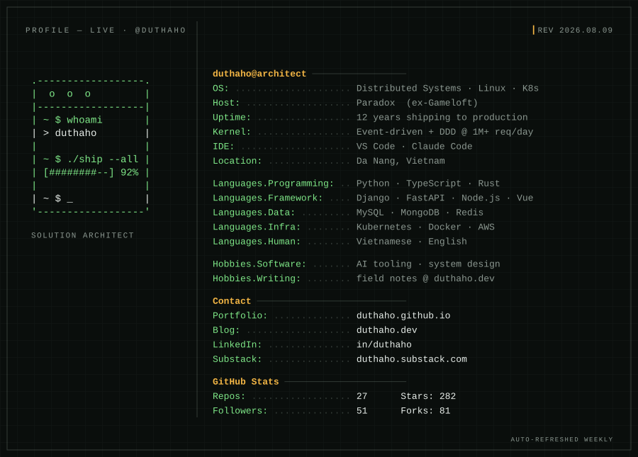
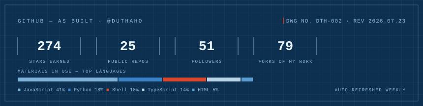

# Duong Thanh Hop

**Solution Architect** · Da Nang, Vietnam

---

I design systems that scale — and the teams that ship them. Twelve years from AAA mobile titles at **Gameloft** to the AI-powered recruitment platform at **Paradox** (1M+ daily requests): a URL-shortening service on DocumentDB that took the hot path off MySQL, a SaltStack → Kubernetes migration, and event-driven + DDD patterns laid down as paved roads. These days I build my own products and AI tooling, and write about the craft at [duthaho.dev](https://duthaho.dev).

**Stack** &nbsp; `Python` · `TypeScript` · `Django` · `FastAPI` · `Node.js` · `Vue` · `MySQL` · `MongoDB` · `Redis` · `Kubernetes` · `Docker` · `AWS`

### Currently

- Building AI tooling and personal products — see the pins below
- Publishing field notes on AI engineering at [duthaho.dev](https://duthaho.dev)
- Open to Solution Architect roles — [career architecture, drawn to scale ↗](https://duthaho.github.io)

### Selected work

- **[claudekit](https://github.com/duthaho/claudekit)**  — a verification-first engineering toolkit for Claude Code, built for senior ICs and tech leads
- **[js-quiz](https://github.com/duthaho/js-quiz)**  — the JavaScript quiz for learning
- **[agents-in-action](https://github.com/duthaho/agents-in-action)** — a build-along curriculum for understanding AI agents from first principles

### Recent writing

- [We picked Redis Streams over Kafka: and what the docs don't tell you upfront](https://duthaho.dev/redis-streams-over-kafka/) · Jul 12, 2026
- [A rate limiter isn't an algorithm-picking problem: an interview that just kept digging deeper](https://duthaho.dev/designing-a-rate-limiter/) · Jul 5, 2026
- [Redis never gives you anything for free: the hidden price behind every layer of cache](https://duthaho.dev/caching-is-never-free/) · Jul 1, 2026
- [From monolith to idempotency:: one thread, not six flashcards](https://duthaho.dev/from-monolith-to-idempotency/) · Jun 30, 2026
- [Two workers: inside the AI machine](https://duthaho.dev/ai-inference-engineering/) · Jun 18, 2026
- [Nine questions I now always ask: when I go into an interview](https://duthaho.dev/questions-i-ask-in-interviews/) · Jun 16, 2026

→ Archive at [duthaho.dev](https://duthaho.dev)

### GitHub

---

Auto-refreshed Sunday, August 9 at 07:44 AM (ICT) · [source](https://github.com/duthaho/duthaho/blob/main/main.mustache) · career architecture at [duthaho.github.io](https://duthaho.github.io)
